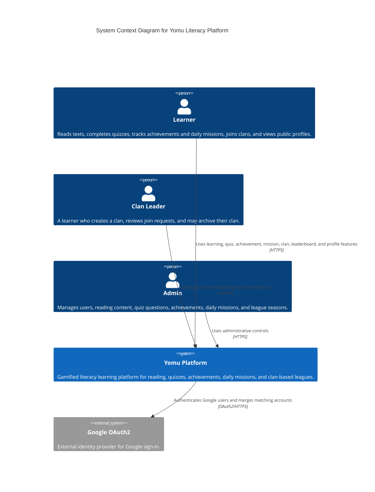
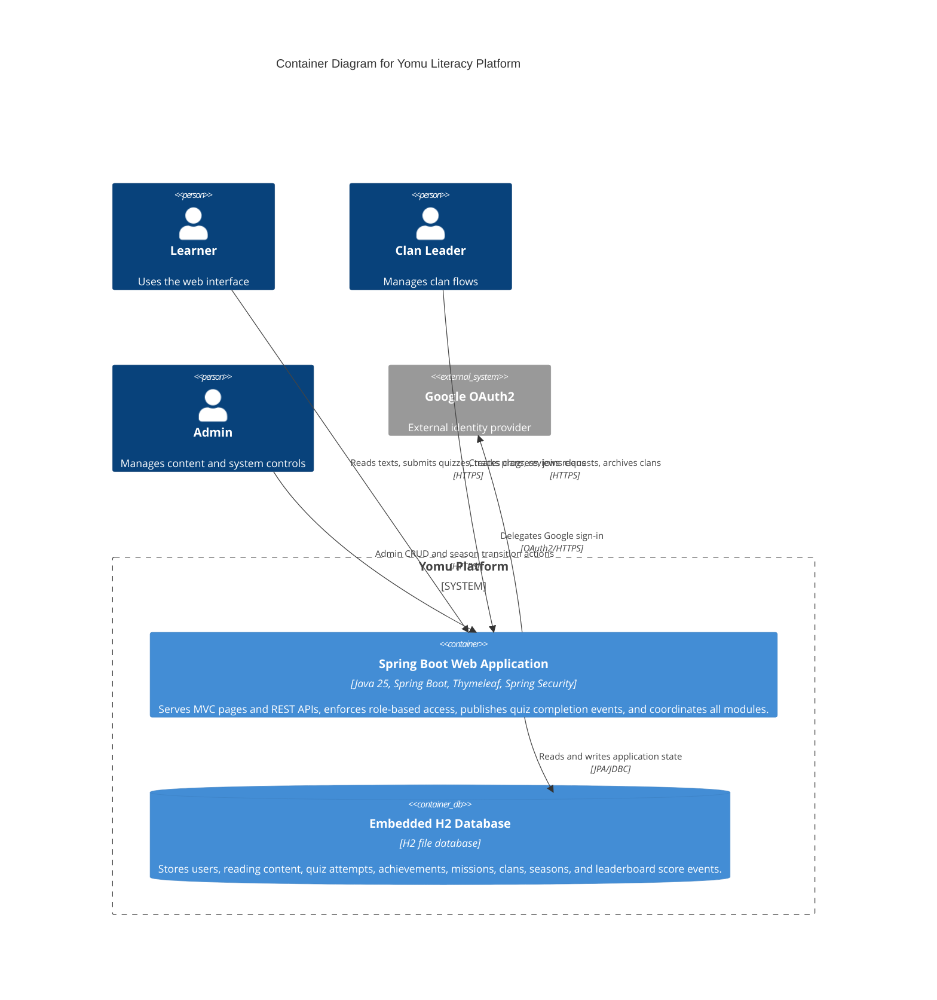
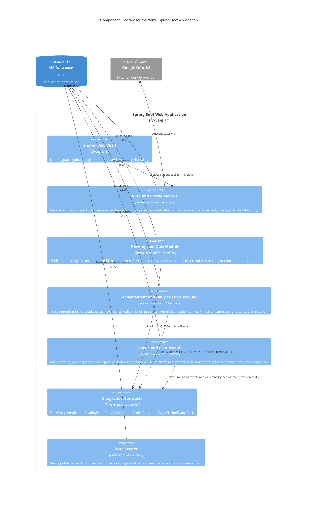
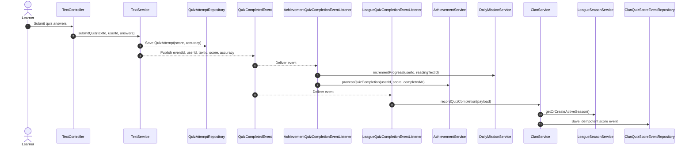
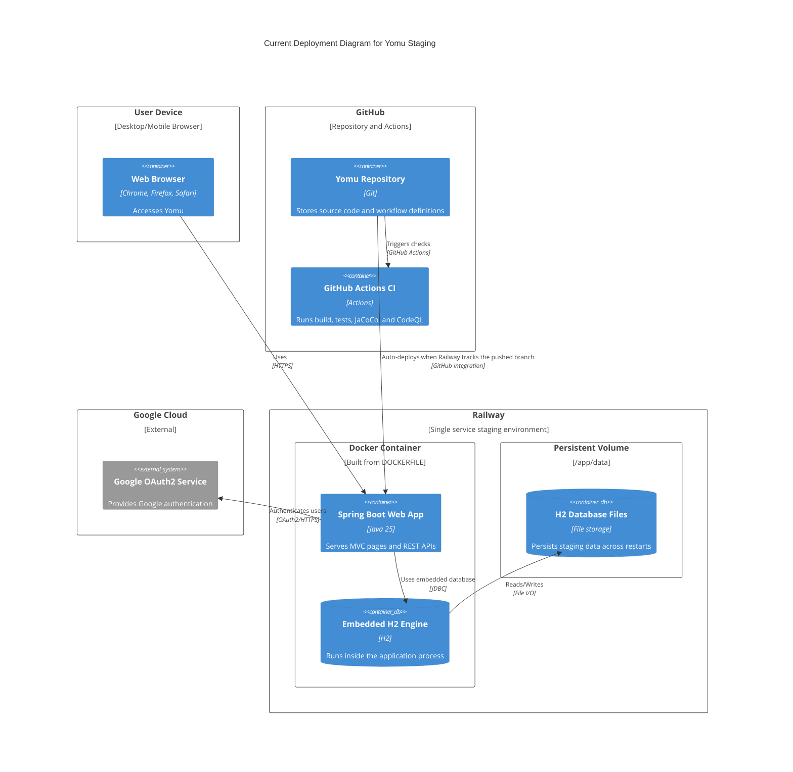
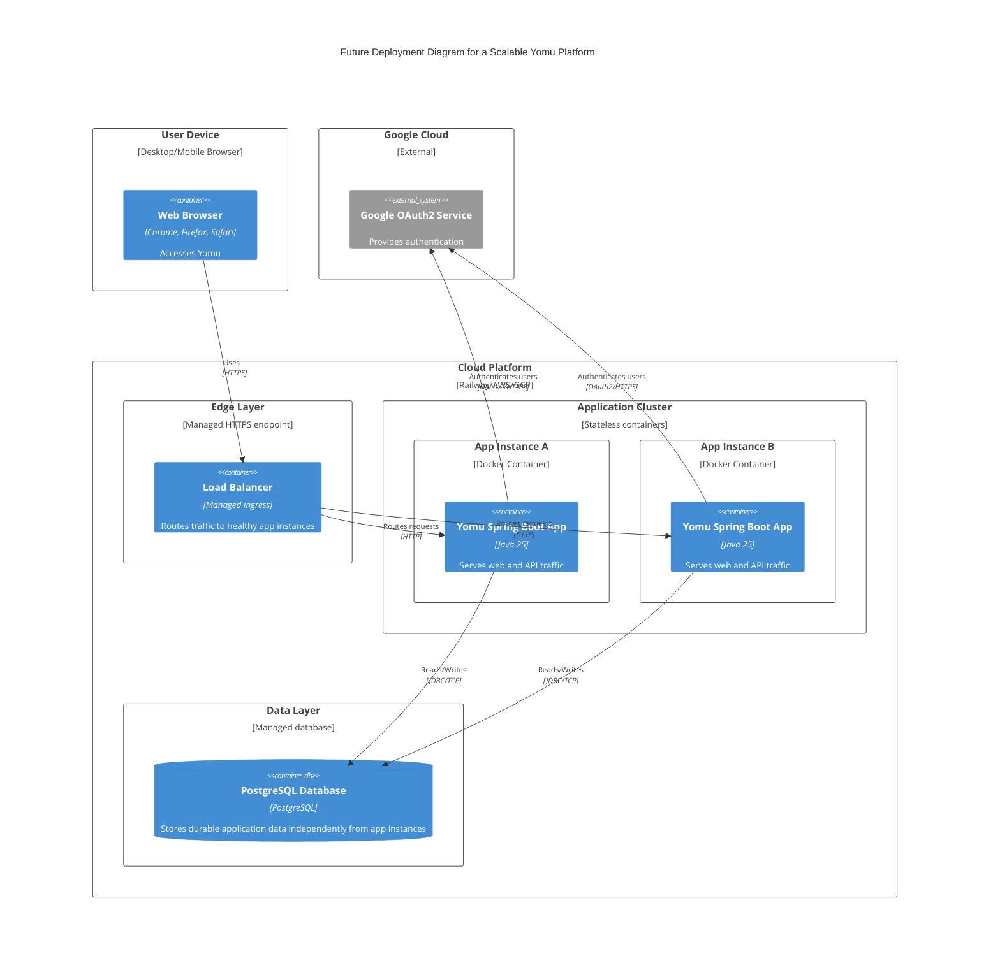
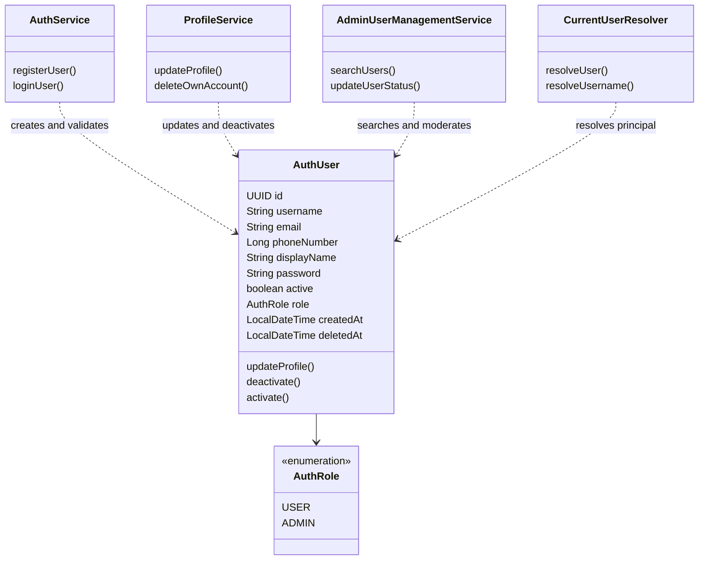
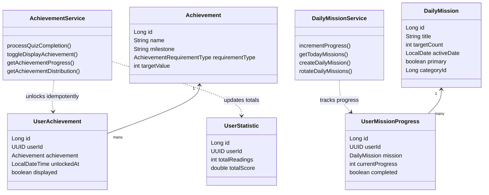
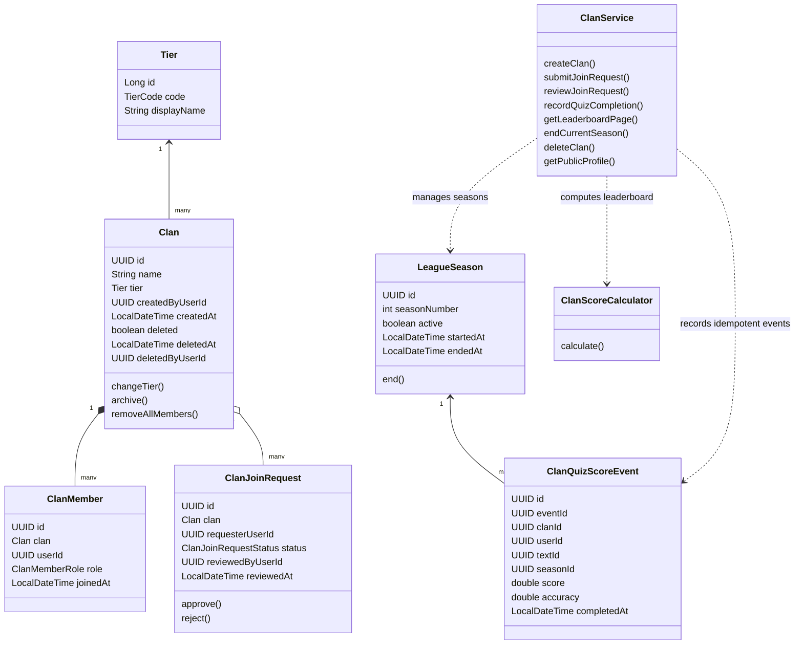

## Yomu Project Overview

Yomu is a gamified literacy learning platform built for the Advanced Programming group project. The application helps users read curated texts, complete quizzes, unlock achievements, track daily missions, and compete through clan-based league progression.

### Delivered Modules

- Auth and security: manual login/register, Google OAuth2, session handling, profile management, public profile, admin user management, CSRF protection, and login/register throttling.
- Reading and quiz: published text library, quiz flow with hidden-source behavior during attempts, quiz history, admin text and question management, and reading statistics API.
- Achievements: achievement unlock flow, selectable profile achievements, daily missions, mission progress tracking, and admin achievement distribution endpoints.
- League and clan: clan creation and join requests, public player profile view, multi-tier leaderboard, dynamic score modifiers, season transition, archived clan handling, and paginated leaderboard UI/API.

### Tech Stack

- Java 25
- Spring Boot + Thymeleaf
- Spring Security + Google OAuth2 client
- Spring Data JPA
- H2 database for local and staging single-app deployment
- Docker / Railway for containerized staging

## Local Setup

### Prerequisites

- JDK 25 installed
- Docker Desktop if you want to run the containerized version

### Environment Variables

Set these through `.env`, terminal environment variables, or your deployment platform.

- `DB_URL`: optional. Local default is `jdbc:h2:file:./data/yomu-db-v2;DB_CLOSE_ON_EXIT=FALSE`.
- `DB_USERNAME`: optional. Local default is `sa`.
- `DB_PASSWORD`: optional for local, required for Docker/Railway.
- `SPRING_PROFILES_ACTIVE`: use `docker` for container deployment.
- `APP_DEMO_SEED`: set to `true` to load staging/demo users, demo clan, and primary daily mission.
- `GOOGLE_CLIENT_ID`: required if Google SSO should be enabled.
- `GOOGLE_CLIENT_SECRET`: required if Google SSO should be enabled.
- `GOOGLE_OAUTH_ENABLED`: optional, defaults to `true`. Set `false` to hide Google OAuth when credentials are unavailable.
- `SESSION_TIMEOUT`: optional, defaults to `15m`.

### Run Locally with Gradle

```bash
./gradlew bootRun
```

On Windows PowerShell:

```powershell
.\gradlew.bat bootRun
```

The app will be available at `http://localhost:8080`.

### Run with Docker Compose

Before starting Docker Compose, set `DB_PASSWORD`.

```powershell
$env:DB_PASSWORD="replace-this-password"
docker compose up --build
```

The container uses:

- `DOCKERFILE` as the build file
- `SPRING_PROFILES_ACTIVE=docker`
- persistent H2 storage mounted at `/app/data`

## Demo Data

### Default Seed

The application always seeds published reading content and quizzes. Outside the plain `docker` profile, it also seeds the admin account below.

- Admin username: `cat`
- Admin email: `hasanul.muttaqin@ui.ac.id`
- Admin password: `pass123`

### Optional Demo Seed

Enable `APP_DEMO_SEED=true` to prepare staging/demo presentation data.

- Demo leader email: `kalfin.demo.leader@yomu.test`
- Demo leader password: `KalfinDemo1!`
- Demo member email: `kalfin.demo.member@yomu.test`
- Demo member password: `KalfinDemo2!`
- Demo clan: `Kalfin Demo Clan`

## Quality Checks

Run the full verification suite with:

```bash
./gradlew clean test jacocoTestReport jacocoTestCoverageVerification
```

The repository includes GitHub Actions CI for:

- build and test
- JaCoCo coverage gate
- CodeQL analysis

## Staging and Deployment Notes

This repository is ready for single-app staging deployment using Railway plus embedded H2 persistence, but the GitHub Actions CD workflow is still a dummy placeholder. That means:

- `ci.yml` will run automatically on pushes and pull requests.
- `.github/workflows/cd-dummy.yml` does not deploy to Railway or any live environment.
- actual staging deployment will happen automatically only if your Railway project is already connected to this repository and tracking the branch you push.

For Railway staging, configure these variables on the platform:

- `SPRING_PROFILES_ACTIVE=docker`
- `DB_PASSWORD=your-strong-password`
- `APP_DEMO_SEED=true` for presentation-ready demo data
- `GOOGLE_CLIENT_ID=your-google-client-id` if Google SSO is required
- `GOOGLE_CLIENT_SECRET=your-google-client-secret` if Google SSO is required
- `GOOGLE_OAUTH_ENABLED=false` if you want staging to run without Google SSO

If Google SSO is enabled, also register the Railway callback URL in Google Cloud Console:

- `https://<your-railway-domain>/login/oauth2/code/google`

## 1. Current Architecture

The architecture diagrams follow the C4 model from Module 09: Context, Container, Component, Code, and Deployment. The diagrams represent the final delivered Yomu codebase, including Auth, Reading and Quiz, Achievements, Daily Missions, League, Clan, public profile, staging seed, and cross-module integration.

### System Context Diagram


### Container Diagram


### Component Diagram


### Quiz Completion Integration Flow


### Deployment Diagram


## 2. Future Architecture

Based on risk storming, the main future risk is the current staging database topology: H2 is simple and effective for a single-app presentation environment, but it is not suitable for horizontal scaling. The expected future architecture keeps the same module boundaries while moving persistence into a standalone database and allowing multiple stateless app instances.

### Future Deployment Diagram


## 3. Explanation of Risk Storming

We used **Risk Storming** to review the delivered architecture against the final feature set, then placed the main risks on the architecture diagrams as Module 09 recommends.

1. **Identify**: the highest-risk area is persistence and availability. The current Railway setup runs one Spring Boot container and one embedded H2 file database under `/app/data`. This is excellent for a simple staging demo, but the application and database lifecycles are tightly coupled.
2. **Assess**: the risk becomes significant if Yomu gains many concurrent learners. A single app instance is a reliability bottleneck, and an embedded H2 file database cannot be safely shared by multiple app instances for horizontal scaling.
3. **Mitigate**: the future architecture moves the database to PostgreSQL and treats Spring Boot instances as stateless. This enables load balancing, independent database backups, safer scaling, and clearer operational boundaries while preserving the existing modular package structure.

## 4. Code Diagrams

### Auth and Profile Code Diagram


### Reading and Quiz Code Diagram


### Achievement and Daily Mission Code Diagram


### League and Clan Code Diagram

