## Yomu Project Overview

Yomu is a gamified literacy learning platform built for the Advanced Programming group project. The application helps users read curated texts, complete quizzes, unlock achievements, track daily missions, and compete through clan-based league progression.

### Delivered Modules

- Auth and security: manual login/register, Google OAuth2, session handling, profile management, public profile, admin user management, CSRF protection, and login/register throttling.
- Reading and quiz: published text library, quiz flow with hidden-source behavior during attempts, quiz history, admin text and question management, and reading statistics API.
- Achievements: achievement unlock flow, selectable profile achievements, daily missions, mission progress tracking, and admin achievement distribution endpoints.
- League and clan: clan creation and join requests, public player profile view, multi-tier leaderboard, dynamic score modifiers, season transition, archived clan handling, and paginated leaderboard UI/API.

### Tech Stack

- Java 25
- Spring Boot + Thymeleaf
- Spring Security + Google OAuth2 client
- Spring Data JPA
- H2 database for local and staging single-app deployment
- Docker / Railway for containerized staging

## Local Setup

### Prerequisites

- JDK 25 installed
- Docker Desktop if you want to run the containerized version

### Environment Variables

Set these through `.env`, terminal environment variables, or your deployment platform.

- `DB_URL`: optional. Local default is `jdbc:h2:file:./data/yomu-db-v2;DB_CLOSE_ON_EXIT=FALSE`.
- `DB_USERNAME`: optional. Local default is `sa`.
- `DB_PASSWORD`: optional for local, required for Docker/Railway.
- `SPRING_PROFILES_ACTIVE`: use `docker` for container deployment.
- `APP_DEMO_SEED`: set to `true` to load staging/demo users, demo clan, and primary daily mission.
- `GOOGLE_CLIENT_ID`: required if Google SSO should be enabled.
- `GOOGLE_CLIENT_SECRET`: required if Google SSO should be enabled.
- `GOOGLE_OAUTH_ENABLED`: optional, defaults to `true`. Set `false` to hide Google OAuth when credentials are unavailable.
- `SESSION_TIMEOUT`: optional, defaults to `15m`.

### Run Locally with Gradle

```bash
./gradlew bootRun
```

On Windows PowerShell:

```powershell
.\gradlew.bat bootRun
```

The app will be available at `http://localhost:8080`.

### Run with Docker Compose

Before starting Docker Compose, set `DB_PASSWORD`.

```powershell
$env:DB_PASSWORD="replace-this-password"
docker compose up --build
```

The container uses:

- `DOCKERFILE` as the build file
- `SPRING_PROFILES_ACTIVE=docker`
- persistent H2 storage mounted at `/app/data`

## Demo Data

### Default Seed

The application always seeds published reading content and quizzes. Outside the plain `docker` profile, it also seeds the admin account below.

- Admin username: `cat`
- Admin email: `hasanul.muttaqin@ui.ac.id`
- Admin password: `pass123`

### Optional Demo Seed

Enable `APP_DEMO_SEED=true` to prepare staging/demo presentation data.

- Demo leader email: `kalfin.demo.leader@yomu.test`
- Demo leader password: `KalfinDemo1!`
- Demo member email: `kalfin.demo.member@yomu.test`
- Demo member password: `KalfinDemo2!`
- Demo clan: `Kalfin Demo Clan`

## Quality Checks

Run the full verification suite with:

```bash
./gradlew clean test jacocoTestReport jacocoTestCoverageVerification
```

The repository includes GitHub Actions CI for:

- build and test
- JaCoCo coverage gate
- CodeQL analysis

## Monitoring and Profiling

The app includes Spring Boot Actuator and Micrometer Prometheus metrics for safe production monitoring.

Only these Actuator endpoints are exposed:

- `/actuator/health`
- `/actuator/info`
- `/actuator/metrics`
- `/actuator/metrics/http.server.requests`
- `/actuator/prometheus`

The app intentionally does not expose all Actuator endpoints. `/actuator/**` is protected by Spring Security and requires an admin account.

After the app receives traffic, `/actuator/metrics/http.server.requests` shows HTTP request timing metrics. `/actuator/health` should report `UP` for a healthy deployment.

Important Thymeleaf page controllers log preparation time for dashboard, list, detail, search/filter, profile, leaderboard, and reading pages. These logs help identify slow controller preparation before template rendering.

### Optional Java Flight Recorder

For short profiling sessions, run Java Flight Recorder manually. Do not enable this permanently in production.

For Gradle builds:

```bash
java -XX:StartFlightRecording=duration=60s,filename=profile.jfr -jar build/libs/yomu-0.0.1-SNAPSHOT.jar
```

The `.jfr` file can be opened with JDK Mission Control.

### Performance Review Notes

- Reading user pages already use pagination for published text lists. Keep this pattern for future large collections.
- Admin text filtering currently loads all texts before filtering in service code; consider repository-level filtering or pagination if the text catalog grows.
- Achievement pages load all achievements and categories for the page; add pagination or cached category lists if these become large.
- League pages resolve display names in batches, which avoids the most obvious repeated user lookup issue. Keep batching for future member/request views.
- Avoid adding heavy business logic to Thymeleaf templates; keep data shaping in controllers or services.
- Keep large static assets compressed and avoid embedding oversized images directly in templates.
- Current-user resolution reads account data from the database on authenticated pages. If this becomes hot, consider request-scoped caching.

## Staging and Deployment Notes

The final CD path uses GitHub Actions as the deployment gate for a single Railway app with embedded H2 persistence:

- `ci.yml` runs on pushes and pull requests.
- `.github/workflows/cd-railway.yml` deploys only after `CI Quality Gate` succeeds on the `staging` branch.
- The deploy job checks out the exact commit that passed CI, syncs production variables to Railway, deploys with `railway up`, and smoke-tests `/auth/login`.
- GitHub Secrets are used by the workflow only; they do not automatically become Railway runtime variables unless the CD workflow syncs them.

Configure these GitHub Actions secrets or variables before pushing to `staging`:

- `RAILWAY_TOKEN`: Railway Project Token for the target project/environment. Rotate this token if it was ever shared.
- `RAILWAY_SERVICE`: Railway service name for the Yomu app.
- `RAILWAY_ENVIRONMENT`: Railway environment name, usually `production`.
- `RAILWAY_PUBLIC_URL`: public Railway URL used by the smoke test, for example `https://yomu.up.railway.app`. Include `https://` for clarity; the workflow also normalizes missing schemes.
- `RAILWAY_DB_PASSWORD`: strong password for the H2 database user in production.
- `GOOGLE_CLIENT_ID`: Google OAuth client ID.
- `GOOGLE_CLIENT_SECRET`: Google OAuth client secret.
- `APP_DEMO_SEED`: optional, defaults to `true` for presentation data. Set `false` for a clean production seed.
- `SESSION_TIMEOUT`: optional, defaults to `15m`.

The workflow syncs these Railway runtime variables automatically:

- `SPRING_PROFILES_ACTIVE=docker`
- `DB_USERNAME=yomu`
- `DB_PASSWORD` from `RAILWAY_DB_PASSWORD`
- `APP_DEMO_SEED`
- `GOOGLE_OAUTH_ENABLED=true`
- `GOOGLE_CLIENT_ID`
- `GOOGLE_CLIENT_SECRET`
- `APP_OAUTH2_GOOGLE_REDIRECT_URI`, derived from `RAILWAY_PUBLIC_URL`
- `SESSION_TIMEOUT`

You do not need to set `PORT`, `DB_URL`, `DB_DRIVER`, or `H2_WEB_ALLOW_OTHERS` manually for Railway. Railway provides `PORT`, while the `docker` Spring profile already configures H2 storage at `/app/data/yomu-db` and disables the H2 console.

If Google SSO is enabled, also register the Railway callback URL in Google Cloud Console:

- `https://<your-railway-domain>/login/oauth2/code/google`

## 1. Current Architecture

The architecture diagrams follow the C4 model from Module 09: Context, Container, Component, Code, and Deployment. The diagrams represent the final delivered Yomu codebase, including Auth, Reading and Quiz, Achievements, Daily Missions, League, Clan, public profile, staging seed, and cross-module integration.

### System Context Diagram
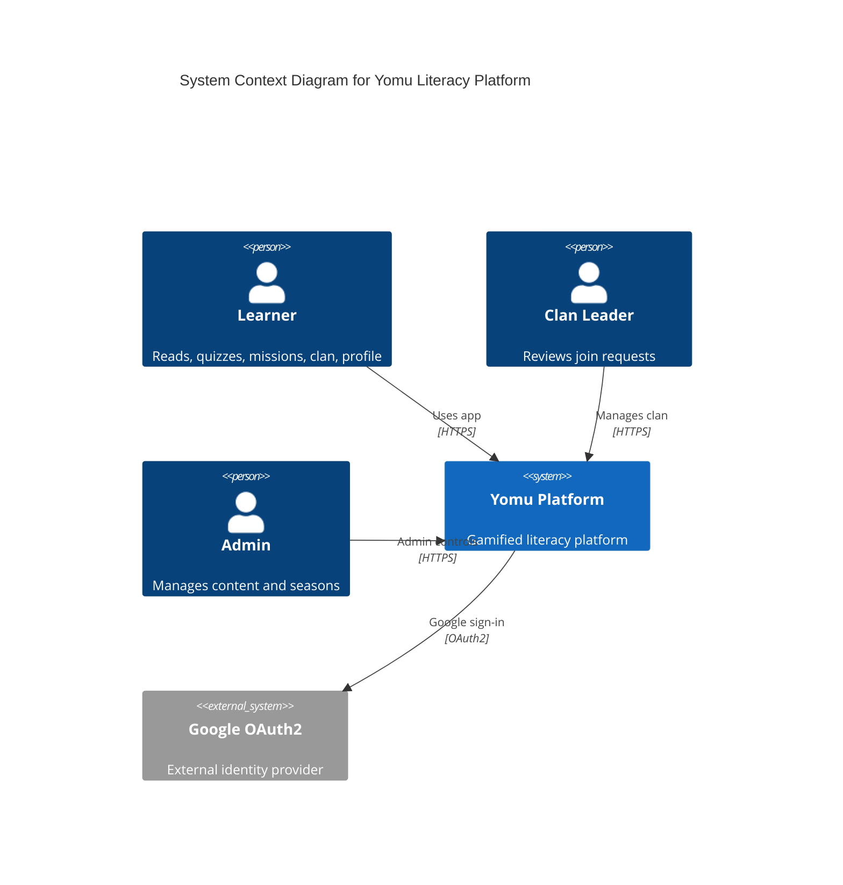

### Container Diagram
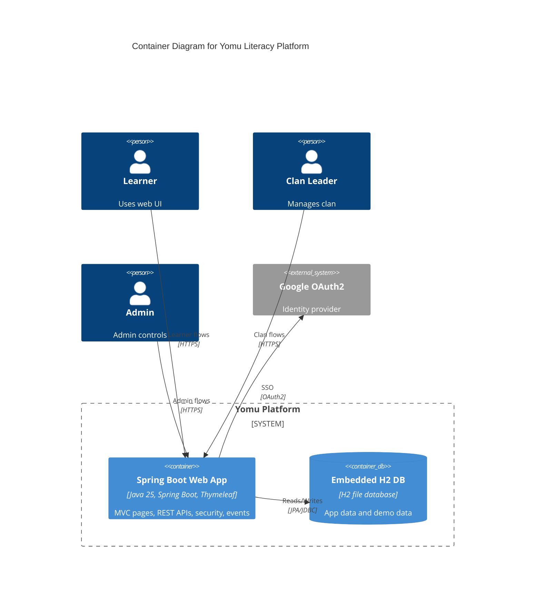

### Component Diagram
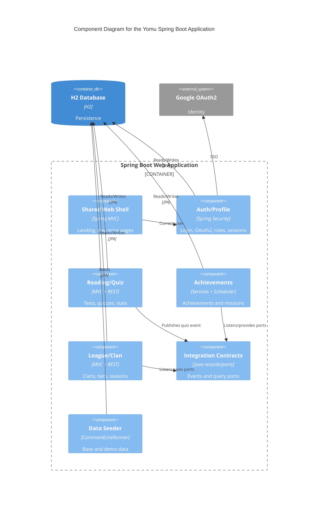

### Auth Module Component Diagram
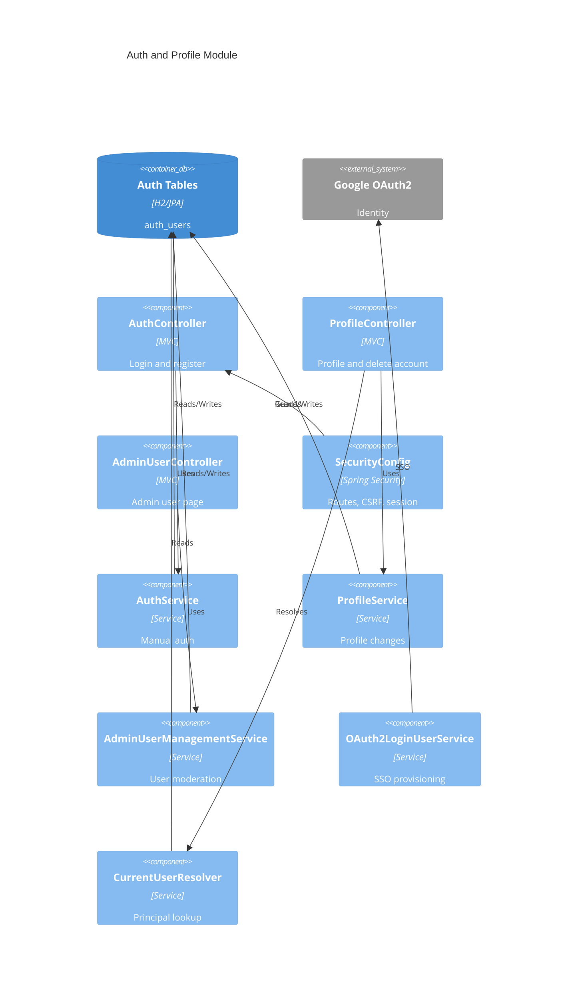

### Reading and Quiz Module Component Diagram
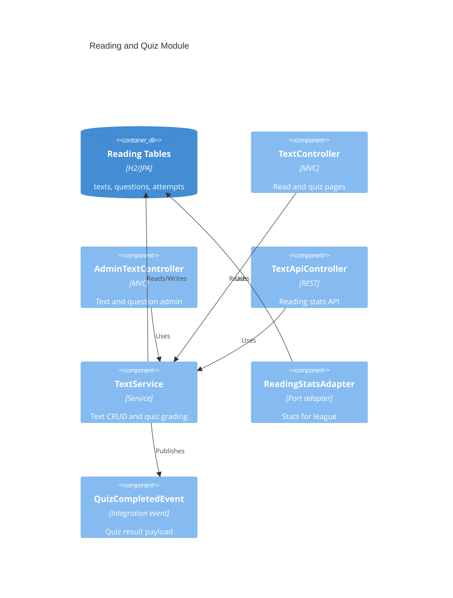

### Achievement Module Component Diagram
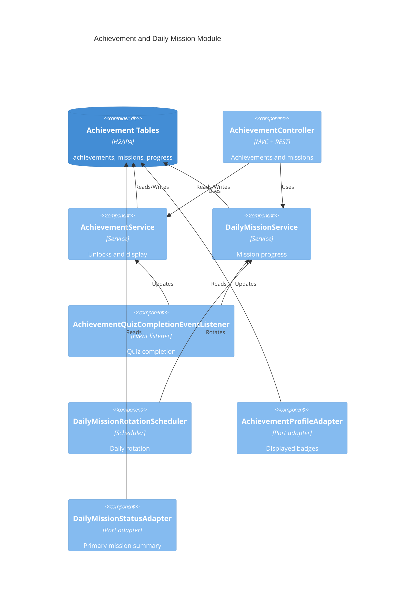

### League and Clan Module Component Diagram
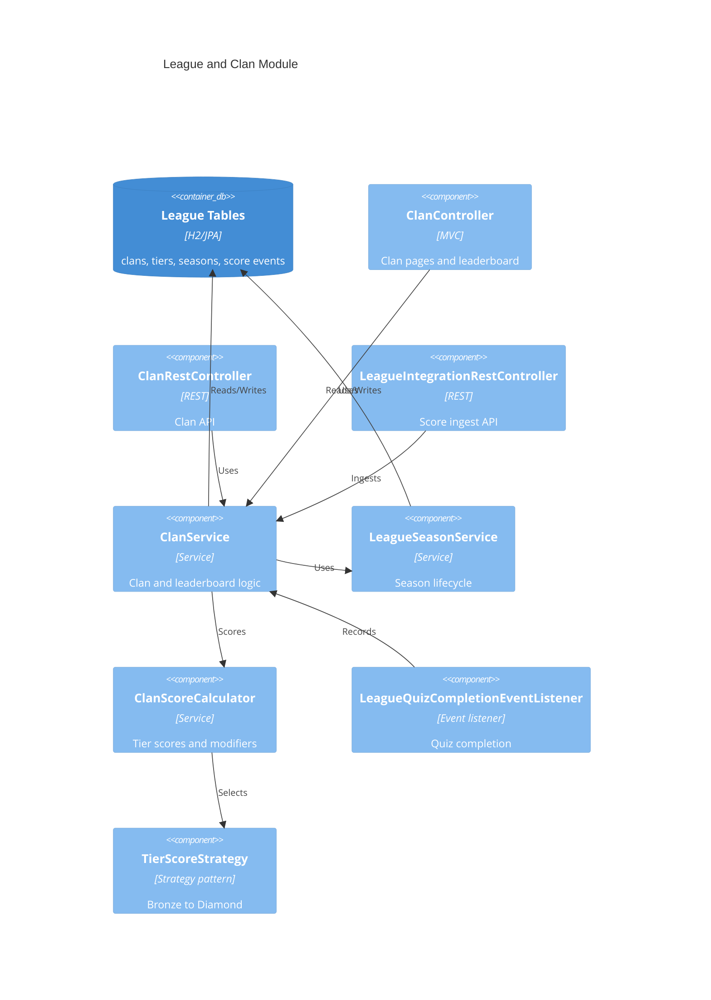

### Quiz Completion Integration Flow
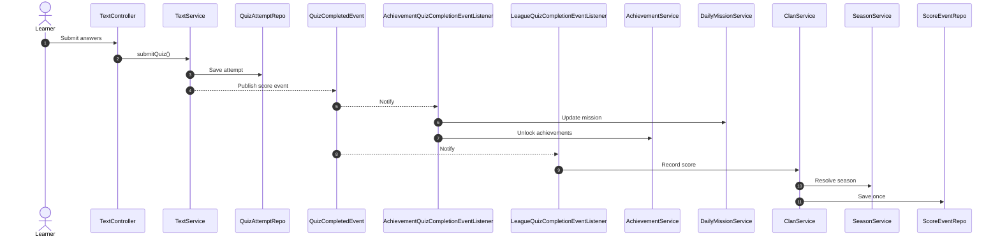

### Deployment Diagram
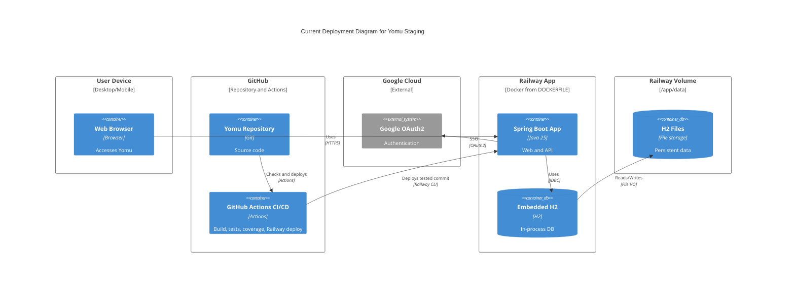

## 2. Future Architecture

Based on risk storming, the main future risk is the current staging database topology: H2 is simple and effective for a single-app presentation environment, but it is not suitable for horizontal scaling. The expected future architecture keeps the same module boundaries while moving persistence into a standalone database and allowing multiple stateless app instances.

### Future Deployment Diagram
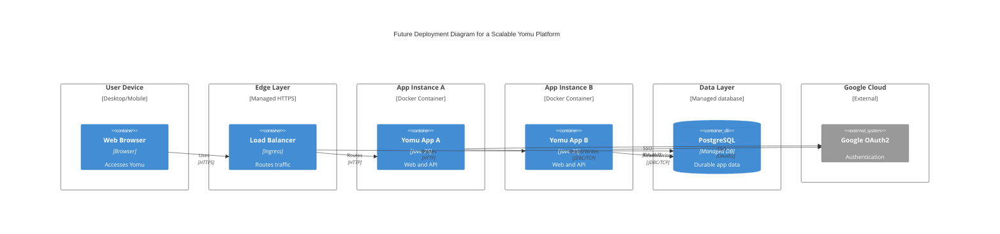

## 3. Explanation of Risk Storming

We used **Risk Storming** to review the delivered architecture against the final feature set, then placed the main risks on the architecture diagrams as Module 09 recommends.

1. **Identify**: the highest-risk area is persistence and availability. The current Railway setup runs one Spring Boot container and one embedded H2 file database under `/app/data`. This is excellent for a simple staging demo, but the application and database lifecycles are tightly coupled.
2. **Assess**: the risk becomes significant if Yomu gains many concurrent learners. A single app instance is a reliability bottleneck, and an embedded H2 file database cannot be safely shared by multiple app instances for horizontal scaling.
3. **Mitigate**: the future architecture moves the database to PostgreSQL and treats Spring Boot instances as stateless. This enables load balancing, independent database backups, safer scaling, and clearer operational boundaries while preserving the existing modular package structure.

## 4. Code Diagrams

### Auth and Profile Code Diagram
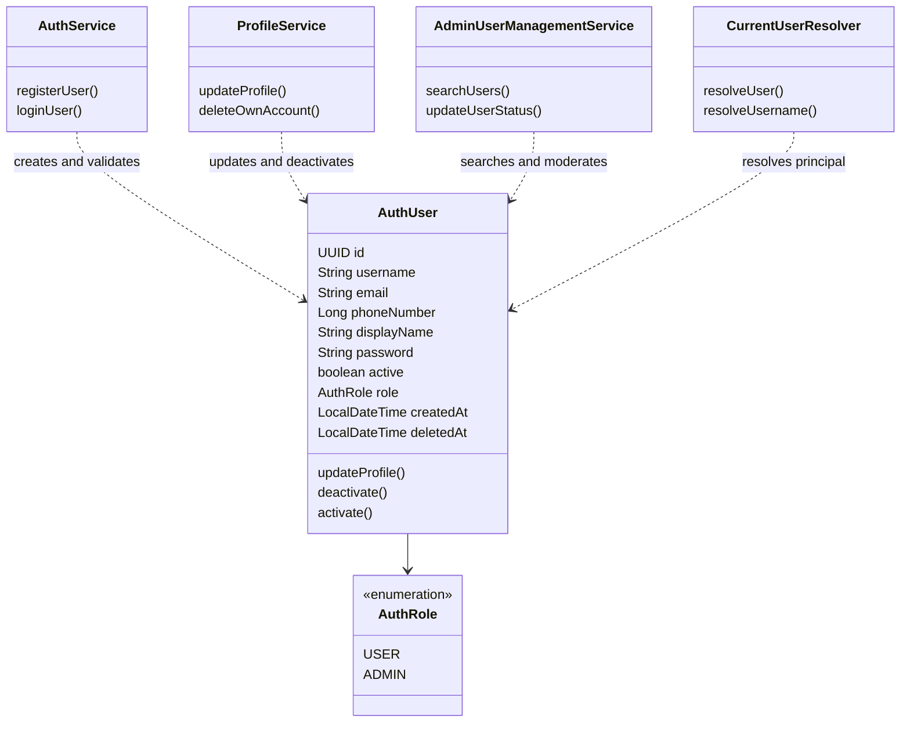

### Reading and Quiz Code Diagram
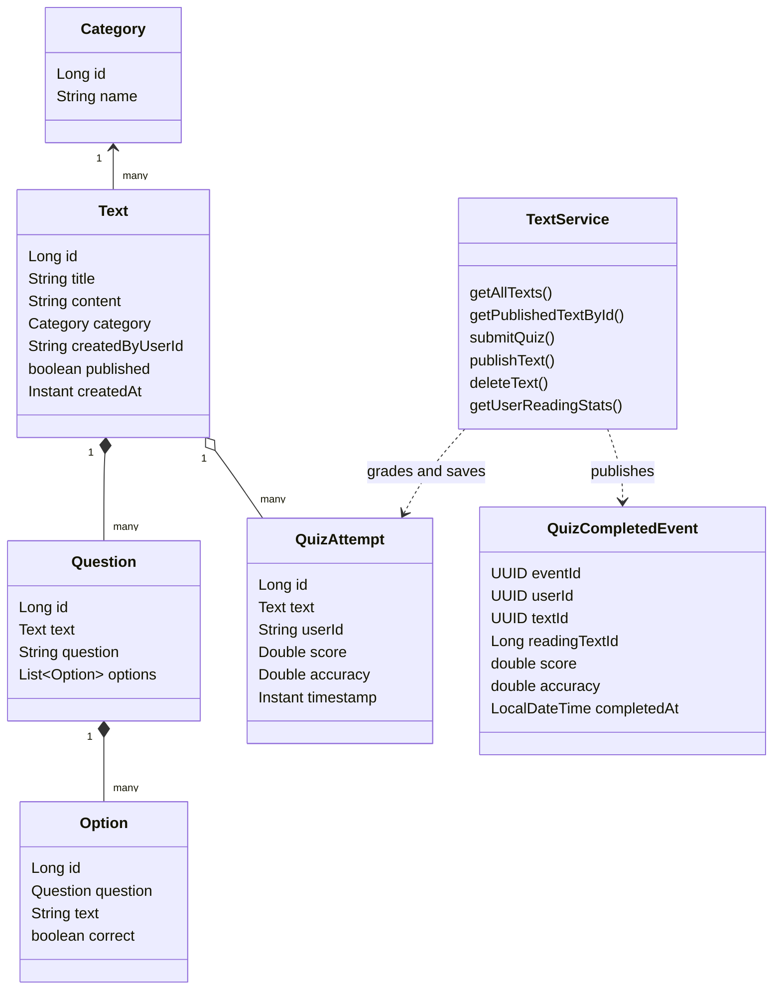

### Achievement and Daily Mission Code Diagram
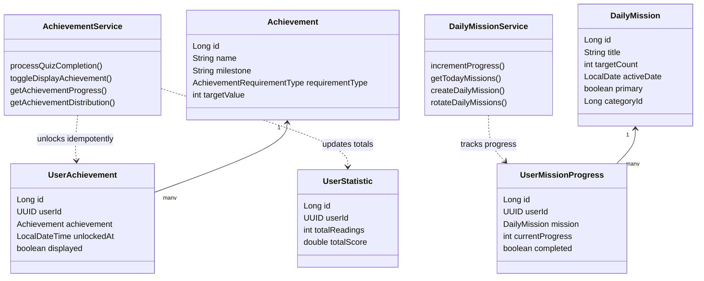

### League and Clan Code Diagram
```mermaid
classDiagram
    class Clan {
        UUID id
        String name
        Tier tier
        UUID createdByUserId
        LocalDateTime createdAt
        boolean deleted
        LocalDateTime deletedAt
        UUID deletedByUserId
        changeTier()
        archive()
        removeAllMembers()
    }

    class ClanMember {
        UUID id
        Clan clan
        UUID userId
        ClanMemberRole role
        LocalDateTime joinedAt
    }

    class ClanJoinRequest {
        UUID id
        Clan clan
        UUID requesterUserId
        ClanJoinRequestStatus status
        UUID reviewedByUserId
        LocalDateTime reviewedAt
        approve()
        reject()
    }

    class ClanQuizScoreEvent {
        UUID id
        UUID eventId
        UUID clanId
        UUID userId
        UUID textId
        UUID seasonId
        double score
        double accuracy
        LocalDateTime completedAt
    }

    class LeagueSeason {
        UUID id
        int seasonNumber
        boolean active
        LocalDateTime startedAt
        LocalDateTime endedAt
        end()
    }

    class Tier {
        UUID id
        TierCode code
        String displayName
    }

    class ClanService {
        createClan()
        submitJoinRequest()
        reviewJoinRequest()
        recordQuizCompletion()
        getLeaderboardPage()
        endCurrentSeason()
        deleteClan()
        getPublicProfile()
    }

    class ClanScoreCalculator {
        calculate()
    }

    Tier "1" <-- "many" Clan
    Clan "1" *-- "many" ClanMember
    Clan "1" o-- "many" ClanJoinRequest
    LeagueSeason "1" <-- "many" ClanQuizScoreEvent
    ClanService ..> ClanQuizScoreEvent : records idempotent events
    ClanService ..> LeagueSeason : manages seasons
    ClanService ..> ClanScoreCalculator : computes leaderboard
```
