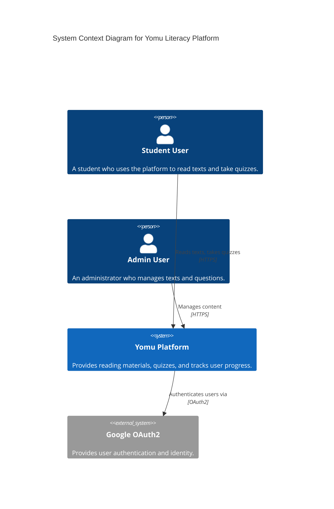
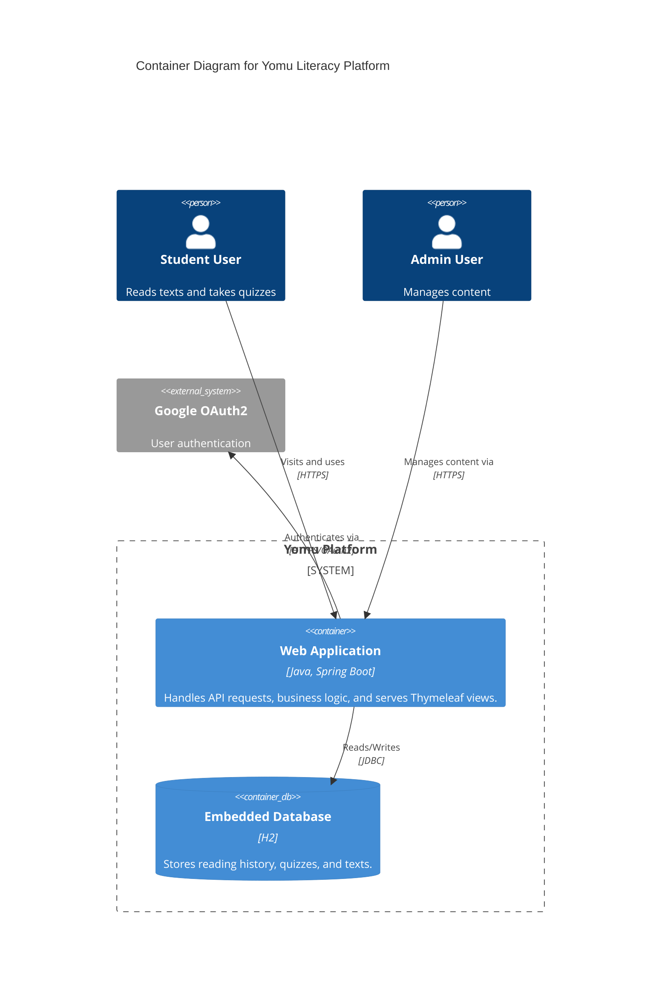
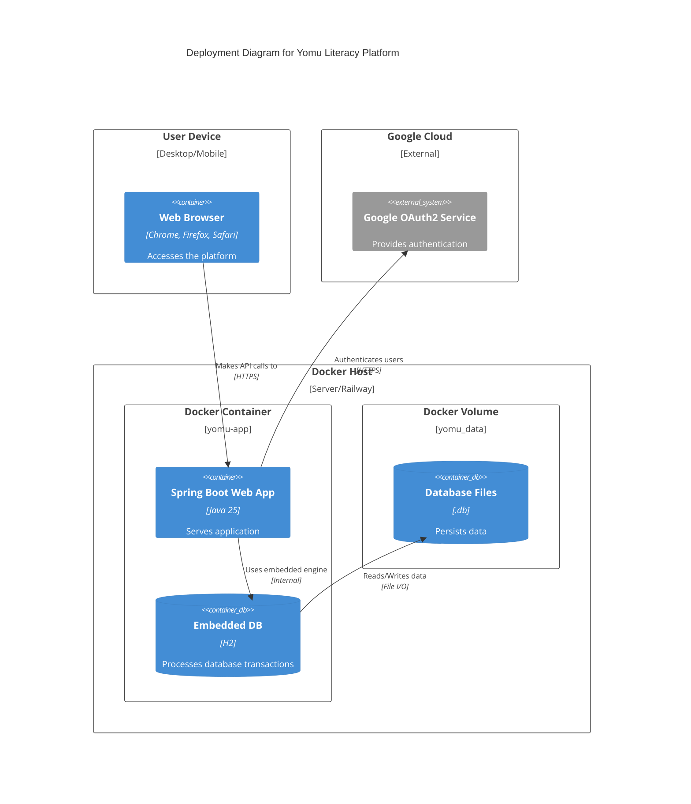
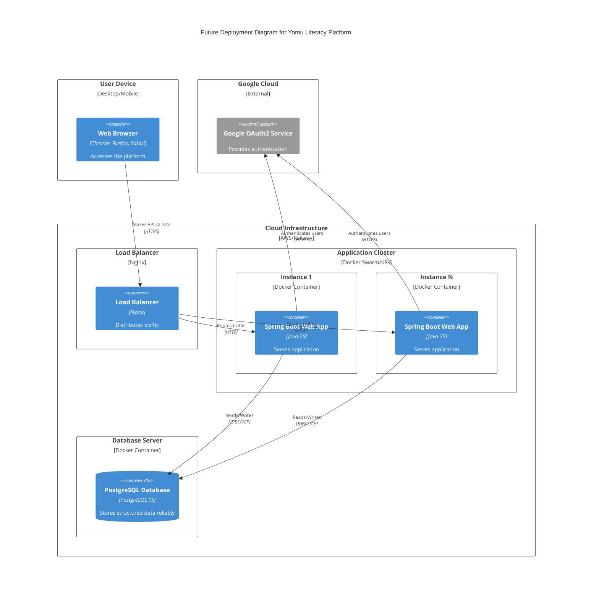
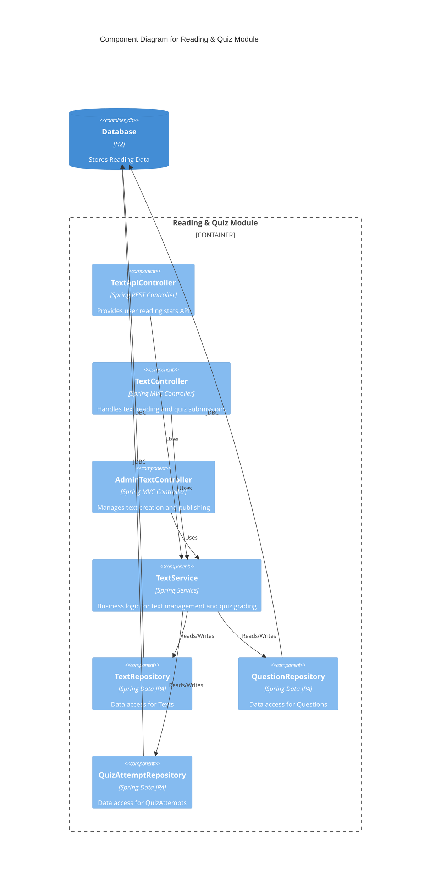
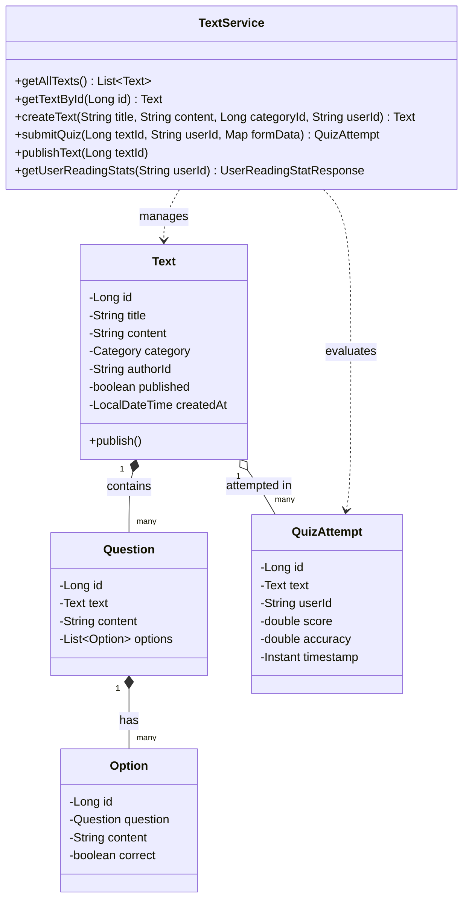
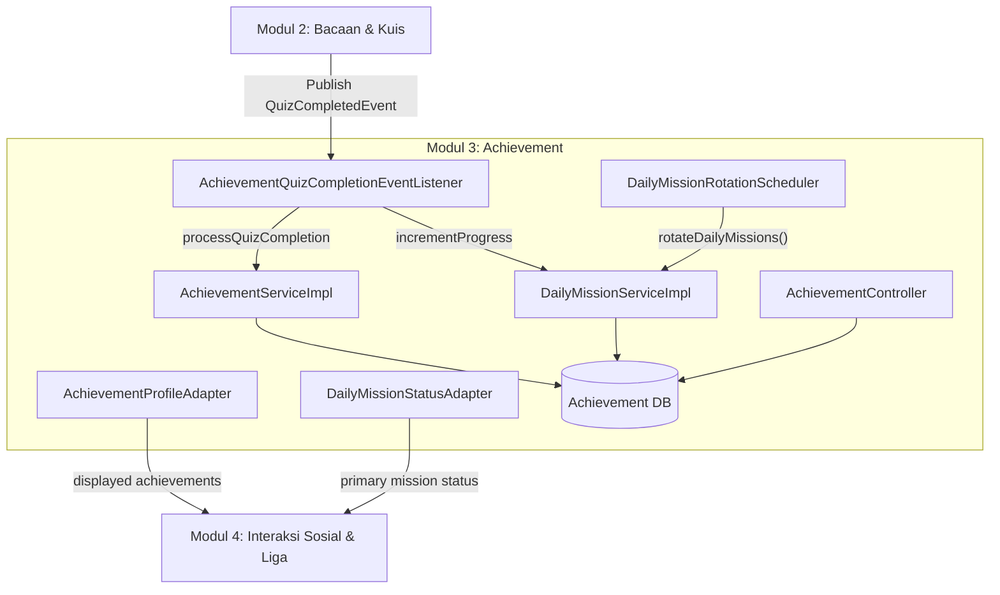
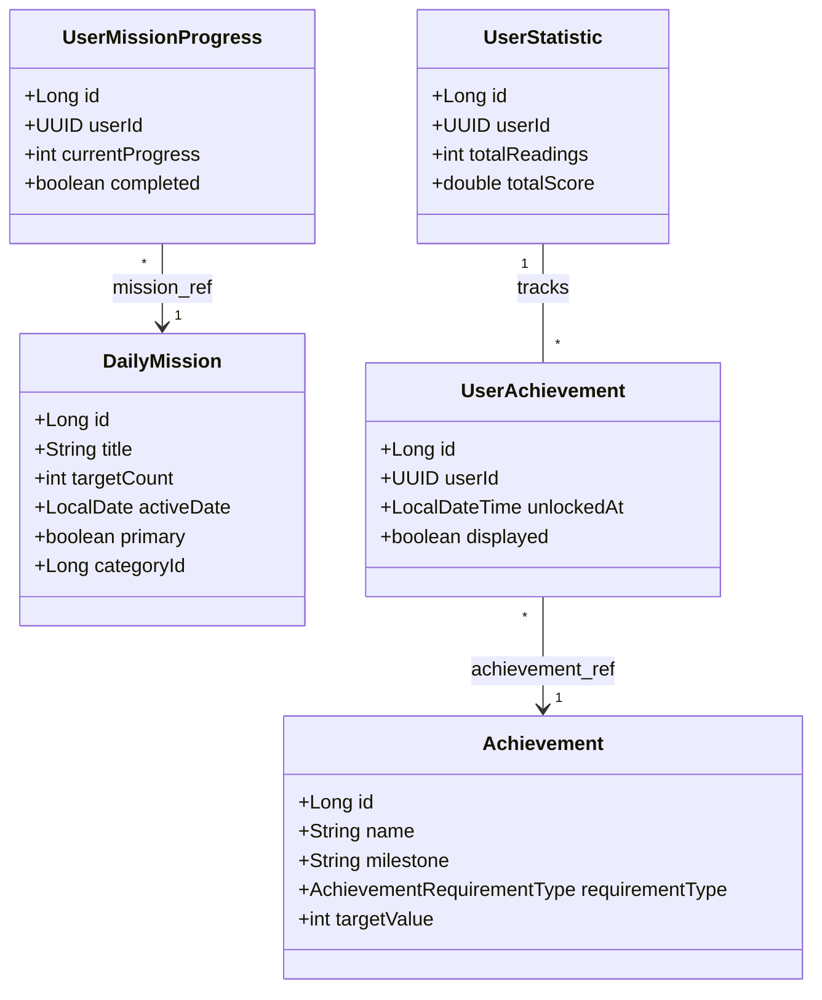

# Tutorial B: Visualizing and Architectural Risk

## 1. Current Architecture

### Context Diagram

### Container Diagram

### Deployment Diagram

## 2. Future Architecture

Based on the Risk Storming exercise, we've designed a future architecture to address scalability constraints. The monolithic approach with an embedded H2 database is replaced with load-balanced application instances and a robust standalone database.

### Future Deployment Diagram

## 3. Explanation of Risk Storming

We applied the **Risk Storming** technique to collaboratively identify, assess, and mitigate architectural risks in the current Yomu Platform. 

1. **Identify**: We mapped out the architecture and identified that the embedded **H2 Database** residing within a Docker container and relying on a Docker volume for persistence is a significant technical debt. It presents a major **Scalability Risk** because multiple instances of the app cannot safely access the same embedded database simultaneously without lock contention or corruption. Furthermore, a single container is a **Single Point of Failure (Reliability Risk)**.
2. **Assess**: Given that our platform anticipates a growing number of students taking reading quizzes simultaneously, the inability to scale horizontally (adding more instances) poses a critical risk to performance and availability.
3. **Mitigate**: We decided to mitigate this by designing a **Future Architecture** that decouples the database from the application container. We will migrate from H2 to a standalone **PostgreSQL** database. This decoupling allows us to introduce a **Load Balancer** and spin up multiple instances of the Spring Boot application (horizontal scaling), thus eliminating the single point of failure and ensuring the system can handle increased traffic securely.

## 4.1 Individual Work (Reading & Quiz Module - Nisrina Alya Nabilah 2406425924)

### Component Diagram (Reading Module)

### Code Diagram (Class Diagram)

## 4.2 Individual Work (Achievement Module - Naufal Fadli Rabbani 2406350785)

### Component Diagram (Reading Module)

### Code Diagram (Class Diagram)

## 4.3. Individual Work (Auth Module - Hasanul Muttaqin 2406413331)

### Component Diagram (Auth Module)

```mermaid
C4Component
title Component Diagram for Auth Module

Person(user, "User", "Registers, logs in, updates profile, and uses protected Yomu features")
Person(admin, "Admin", "Manages registered user accounts")
System_Ext(google_oauth, "Google OAuth2", "External OAuth2 identity provider")

Container_Boundary(auth_module, "Auth Module") {
    Component(auth_ctrl, "AuthController", "Spring MVC Controller", "Handles login page, registration page, and registration submission")
    Component(admin_user_ctrl, "AdminUserController", "Spring MVC Controller", "Handles admin user search and account activation/deactivation")
    Component(security_config, "SecurityConfig", "Spring Security Configuration", "Configures authentication, authorization, OAuth2 login, logout, headers, and password encoding")
    
    Component(login_filter, "LoginRateLimitFilter", "Servlet Filter", "Limits repeated login attempts before authentication processing")
    Component(success_handler, "RateLimitedAuthenticationSuccessHandler", "Spring Security Handler", "Handles successful form login and resets login attempt state")
    Component(failure_handler, "RateLimitedAuthenticationFailureHandler", "Spring Security Handler", "Handles failed login and generic error response")
    
    Component(auth_service, "AuthServiceImpl", "Spring Service", "Handles registration validation, login validation, password hashing, and credential checks")
    Component(user_details_service, "AuthUserDetailsService", "Spring Security Service", "Loads local users for Spring Security authentication")
    Component(oauth_service, "OAuth2LoginUserService", "OAuth2 User Service", "Loads OAuth2 identity data and converts it into an authenticated Yomu principal")
    Component(oauth_provisioning, "OAuth2UserProvisioningService", "Spring Service", "Loads or creates local AuthUser records for OAuth2 users")
    Component(profile_service, "ProfileServiceImpl", "Spring Service", "Handles profile update and own-account deletion")
    Component(admin_user_service, "AdminUserManagementServiceImpl", "Spring Service", "Handles admin-side user search and account status updates")
    
    Component(identifier_validator, "AuthIdentifierValidator", "Validation Component", "Normalizes and validates email or username identifiers")
    Component(password_checker, "PasswordStrengthChecker", "Validation Component", "Assesses password strength during registration")
    Component(email_checker, "EmailExistenceChecker", "Validation Component", "Checks whether registration email appears valid/existing")
    Component(username_service, "UsernameUniquenessService", "Validation Component", "Checks username availability")
    Component(username_generator, "UsernameSuggestionGenerator", "Utility Component", "Generates username suggestion for registration form")
    
    Component(auth_repo, "AuthRepository", "Spring Data JPA Repository", "Persists and queries AuthUser records")
}

ContainerDb(database, "Database", "H2", "Stores authentication users and account data")

Rel(user, auth_ctrl, "Uses login and registration pages", "HTTPS")
Rel(user, security_config, "Submits login/logout through", "HTTPS")
Rel(user, profile_service, "Updates profile and deletes own account through protected pages", "HTTPS")
Rel(admin, admin_user_ctrl, "Manages users", "HTTPS")
Rel(security_config, login_filter, "Adds before UsernamePasswordAuthenticationFilter")
Rel(security_config, success_handler, "Uses for successful form login")
Rel(security_config, failure_handler, "Uses for failed form login")
Rel(security_config, user_details_service, "Uses for local authentication")
Rel(security_config, oauth_service, "Uses for OAuth2 authentication")
Rel(auth_ctrl, auth_service, "Uses")
Rel(auth_ctrl, username_generator, "Uses")
Rel(admin_user_ctrl, admin_user_service, "Uses")
Rel(auth_service, identifier_validator, "Uses")
Rel(auth_service, password_checker, "Uses")
Rel(auth_service, email_checker, "Uses")
Rel(auth_service, username_service, "Uses")
Rel(auth_service, auth_repo, "Reads/Writes")
Rel(user_details_service, auth_repo, "Reads")
Rel(oauth_service, google_oauth, "Loads OAuth2 user info from", "HTTPS/OAuth2")
Rel(oauth_service, oauth_provisioning, "Uses")
Rel(oauth_provisioning, auth_repo, "Reads/Writes")
Rel(oauth_provisioning, username_service, "Uses")
Rel(profile_service, auth_repo, "Reads/Writes")
Rel(admin_user_service, auth_repo, "Reads/Writes")
Rel(auth_repo, database, "JDBC")
```

## Code diagram (class diagram)

```mermaid
classDiagram
    class AuthUser {
        -UUID id
        -String username
        -String email
        -Long phoneNumber
        -String displayName
        -String password
        -boolean active
        -LocalDateTime deletedAt
        -AuthRole role
        -LocalDateTime createdAt
        +updateProfile(String username, String displayName, Long phoneNumber)
        +deactivate()
        +activate()
    }

    class AuthRole {
        <<enumeration>>
        USER
        ADMIN
    }

    class LoginForm {
        -String identifier
        -String password
    }

    class RegisterForm {
        -String email
        -String username
        -String password
    }

    class AuthController {
        -AuthService authService
        -UsernameSuggestionGenerator usernameSuggestionGenerator
        -RegisterAttemptService registerAttemptService
        +authPage()
        +registerPage(Model model)
        +loginPage(Model model)
        +register(RegisterForm form, BindingResult bindingResult, HttpServletRequest request, RedirectAttributes redirectAttributes)
    }

    class AdminUserController {
        -AdminUserManagementService adminUserManagementService
    }

    class SecurityConfig {
        +securityFilterChain(HttpSecurity http, ...)
        +passwordEncoder() BCryptPasswordEncoder
    }

    class AuthService {
        <<interface>>
        +registerUser(RegisterRequest request) RegistrationResult
        +loginUser(LoginRequest request) LoginResult
    }

    class AuthServiceImpl {
        -AuthRepository authRepository
        -EmailExistenceChecker emailExistenceChecker
        -PasswordStrengthChecker passwordStrengthChecker
        -UsernameUniquenessService usernameUniquenessService
        -AuthIdentifierValidator authIdentifierValidator
        -PasswordEncoder passwordEncoder
        +registerUser(RegisterRequest request) RegistrationResult
        +loginUser(LoginRequest request) LoginResult
    }

    class AuthRepository {
        <<interface>>
        +existsByEmail(String email) boolean
        +existsByUsername(String username) boolean
        +findByEmail(String email) Optional~AuthUser~
        +findByUsername(String username) Optional~AuthUser~
        +findByEmailAndActiveTrue(String email) Optional~AuthUser~
        +findByUsernameAndActiveTrue(String username) Optional~AuthUser~
        +searchUsers(String keyword, AuthRole role, Boolean active, Pageable pageable) Page~AuthUser~
    }

    class AuthIdentifierValidator {
        +normalize(String value) String
        +isValidEmail(String email) boolean
        +isValidUsername(String username) boolean
        +classify(String identifier) IdentifierType
    }

    class PasswordStrengthChecker {
        <<interface>>
        +assess(String password) PasswordStrength
    }

    class EmailExistenceChecker {
        <<interface>>
        +exists(String email) boolean
    }

    class UsernameUniquenessService {
        +isUsernameTaken(String username) boolean
    }

    class OAuth2LoginUserService {
        -OAuth2UserIdentityExtractor identityExtractor
        -OAuth2UserProvisioningService provisioningService
        +loadUser(OAuth2UserRequest userRequest) OAuth2User
    }

    class OAuth2UserProvisioningService {
        -AuthRepository authRepository
        -UsernameUniquenessService usernameUniquenessService
        -AuthIdentifierValidator authIdentifierValidator
        +loadOrCreateUser(OAuth2UserIdentity identity) AuthUser
    }

    class ProfileService {
        <<interface>>
        +updateProfile(UpdateProfileRequest request) UpdateProfileResult
        +deleteOwnAccount(DeleteAccountRequest request) DeleteAccountResult
    }

    class AdminUserManagementService {
        <<interface>>
        +searchUsers(String keyword, AuthRole role, Boolean active, Pageable pageable) Page~AuthUser~
        +updateUserStatus(UUID userId, boolean active) boolean
    }

    AuthUser --> AuthRole : has role
    AuthController --> AuthService : uses
    AuthController --> RegisterForm : binds
    AuthController --> LoginForm : prepares
    SecurityConfig --> OAuth2LoginUserService : configures
    SecurityConfig --> AuthUserDetailsService : authenticates local users
    AuthService <|.. AuthServiceImpl : implements
    AuthServiceImpl --> AuthRepository : reads/writes
    AuthServiceImpl --> AuthIdentifierValidator : validates
    AuthServiceImpl --> PasswordStrengthChecker : checks password strength
    AuthServiceImpl --> EmailExistenceChecker : checks email existence
    AuthServiceImpl --> UsernameUniquenessService : checks username uniqueness
    AuthRepository --> AuthUser : manages
    OAuth2LoginUserService --> OAuth2UserProvisioningService : provisions local user
    OAuth2UserProvisioningService --> AuthRepository : reads/writes
    OAuth2UserProvisioningService --> UsernameUniquenessService : generates unique username
    ProfileService --> AuthUser : updates/deactivates
    AdminUserManagementService --> AuthUser : searches/activates/deactivates
```

