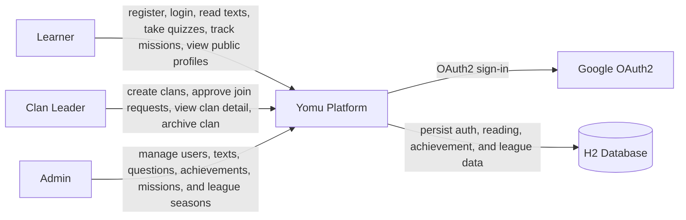
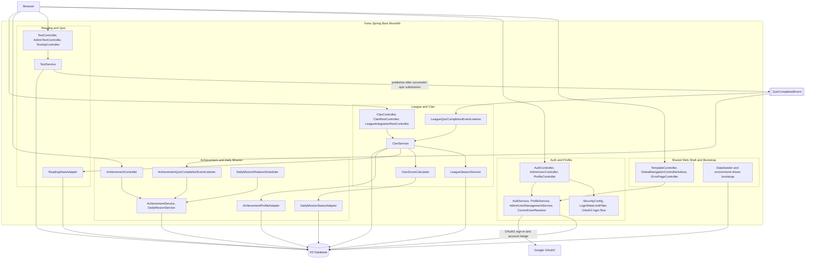
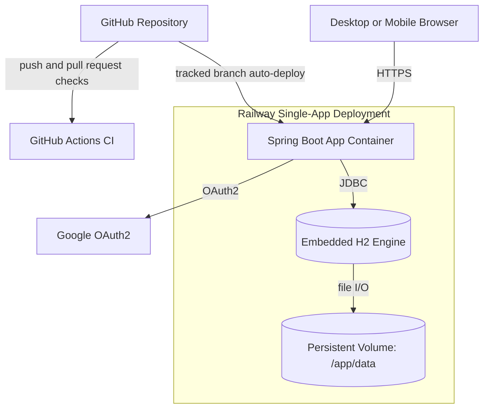
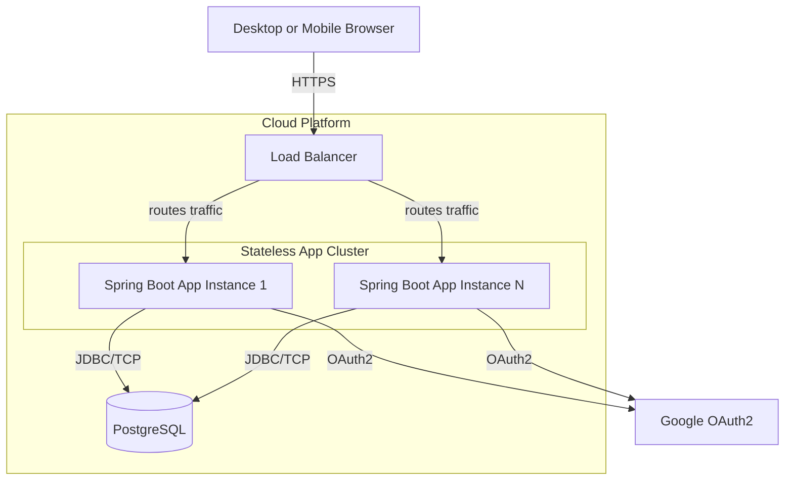
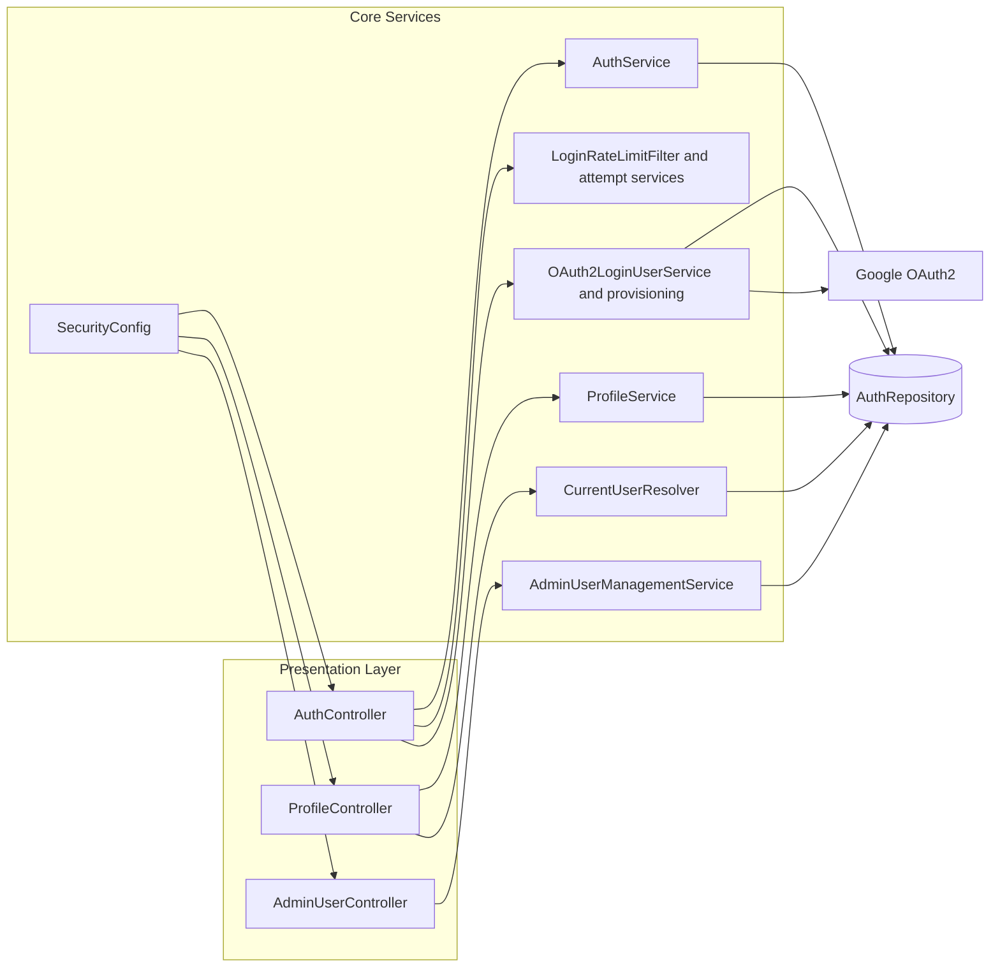
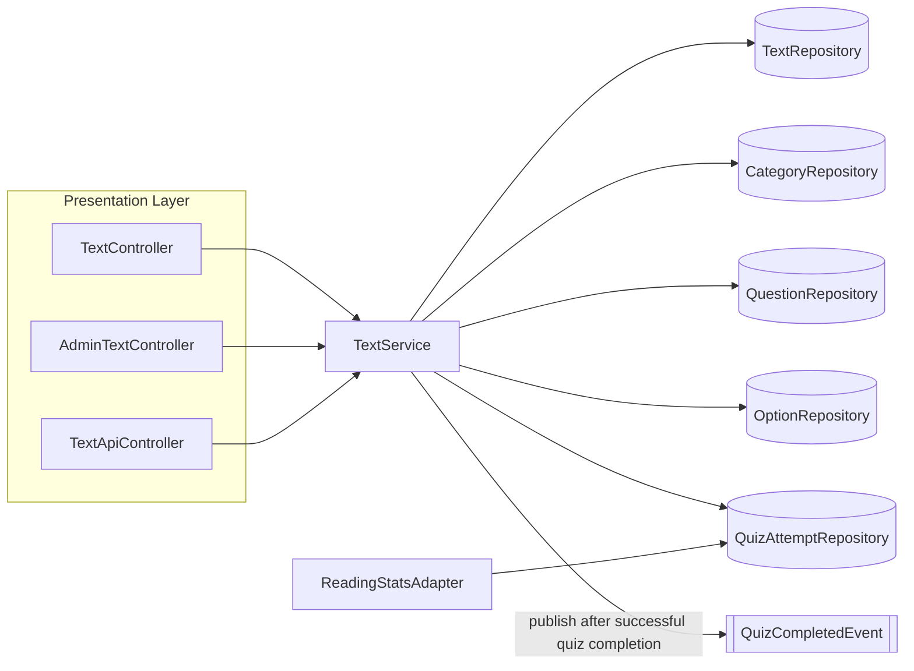
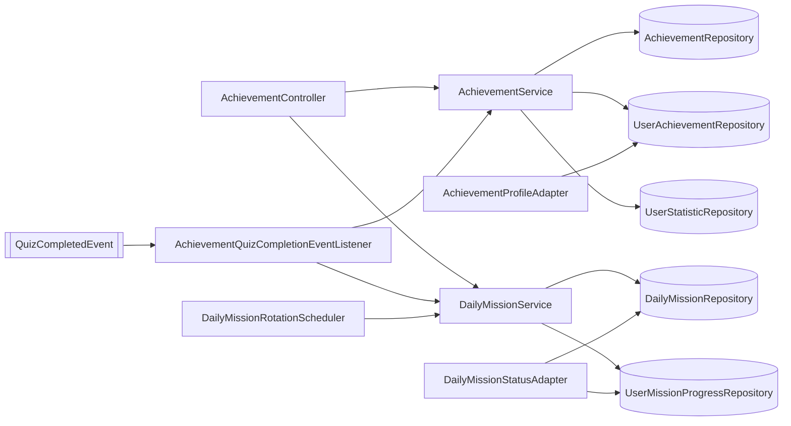
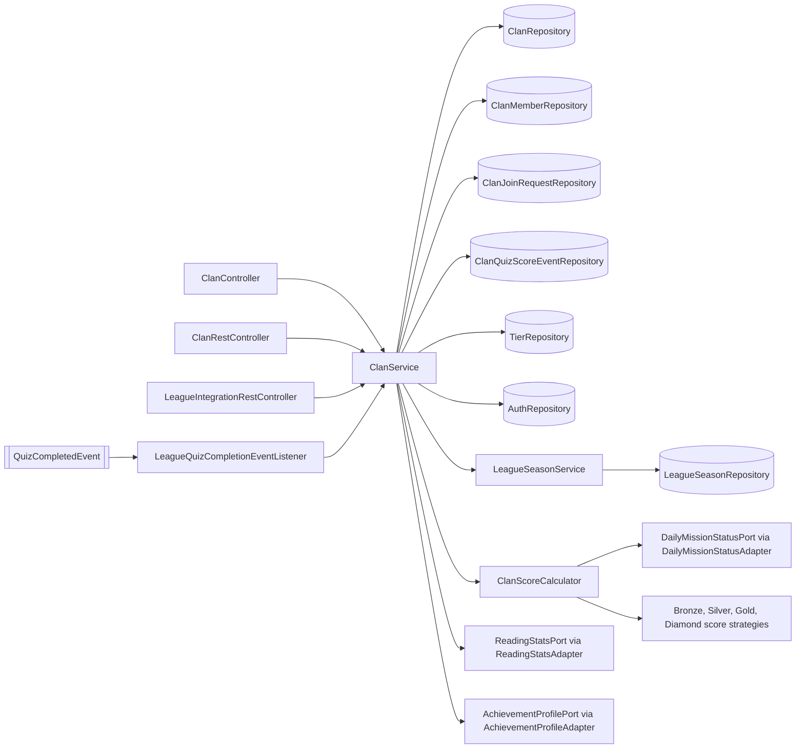
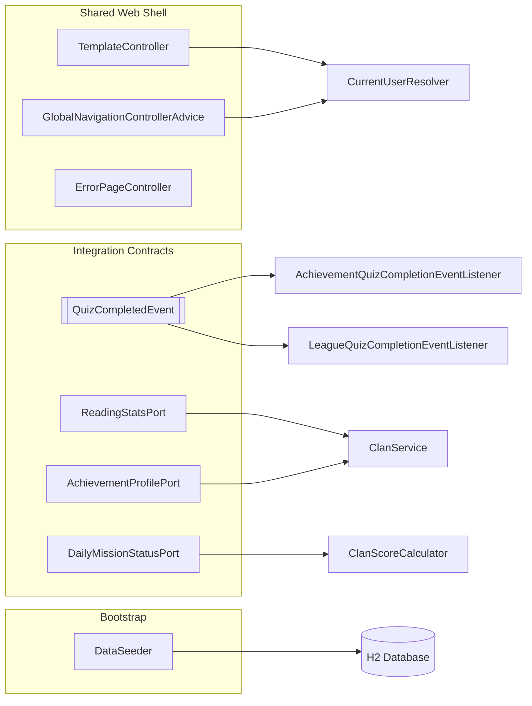

# Tutorial B: Visualizing and Architectural Risk

## Yomu Project Overview

Yomu is a gamified literacy learning platform built for the Advanced Programming group project. The application helps users read curated texts, complete quizzes, unlock achievements, track daily missions, and compete through clan-based league progression.

### Delivered Modules

- Auth and security: manual login/register, Google OAuth2, session handling, profile management, public profile, admin user management, CSRF protection, and login/register throttling.
- Reading and quiz: published text library, quiz flow with hidden-source behavior during attempts, quiz history, admin text and question management, and reading statistics API.
- Achievements: achievement unlock flow, selectable profile achievements, daily missions, mission progress tracking, and admin achievement distribution endpoints.
- League and clan: clan creation and join requests, public player profile view, multi-tier leaderboard, dynamic score modifiers, season transition, archived clan handling, and paginated leaderboard UI/API.

### Tech Stack

- Java 25
- Spring Boot + Thymeleaf
- Spring Security + Google OAuth2 client
- Spring Data JPA
- H2 database for local and staging single-app deployment
- Docker / Railway for containerized staging

## Local Setup

### Prerequisites

- JDK 25 installed
- Docker Desktop if you want to run the containerized version

### Environment Variables

Set these through `.env`, terminal environment variables, or your deployment platform.

- `DB_URL`: optional. Local default is `jdbc:h2:file:./data/yomu-db-v2;DB_CLOSE_ON_EXIT=FALSE`.
- `DB_USERNAME`: optional. Local default is `sa`.
- `DB_PASSWORD`: optional for local, required for Docker/Railway.
- `SPRING_PROFILES_ACTIVE`: use `docker` for container deployment.
- `APP_DEMO_SEED`: set to `true` to load staging/demo users, demo clan, and primary daily mission.
- `GOOGLE_CLIENT_ID`: required if Google SSO should be enabled.
- `GOOGLE_CLIENT_SECRET`: required if Google SSO should be enabled.
- `GOOGLE_OAUTH_ENABLED`: optional, defaults to `true`. Set `false` to hide Google OAuth when credentials are unavailable.
- `SESSION_TIMEOUT`: optional, defaults to `15m`.

### Run Locally with Gradle

```bash
./gradlew bootRun
```

On Windows PowerShell:

```powershell
.\gradlew.bat bootRun
```

The app will be available at `http://localhost:8080`.

### Run with Docker Compose

Before starting Docker Compose, set `DB_PASSWORD`.

```powershell
$env:DB_PASSWORD="replace-this-password"
docker compose up --build
```

The container uses:

- `DOCKERFILE` as the build file
- `SPRING_PROFILES_ACTIVE=docker`
- persistent H2 storage mounted at `/app/data`

## Demo Data

### Default Seed

The application always seeds published reading content and quizzes. Outside the plain `docker` profile, it also seeds the admin account below.

- Admin username: `cat`
- Admin email: `hasanul.muttaqin@ui.ac.id`
- Admin password: `pass123`

### Optional Demo Seed

Enable `APP_DEMO_SEED=true` to prepare staging/demo presentation data.

- Demo leader email: `kalfin.demo.leader@yomu.test`
- Demo leader password: `KalfinDemo1!`
- Demo member email: `kalfin.demo.member@yomu.test`
- Demo member password: `KalfinDemo2!`
- Demo clan: `Kalfin Demo Clan`

## Quality Checks

Run the full verification suite with:

```bash
./gradlew clean test jacocoTestReport jacocoTestCoverageVerification
```

The repository includes GitHub Actions CI for:

- build and test
- JaCoCo coverage gate
- CodeQL analysis

## Staging and Deployment Notes

This repository is ready for single-app staging deployment using Railway plus embedded H2 persistence, but the GitHub Actions CD workflow is still a dummy placeholder. That means:

- `ci.yml` will run automatically on pushes and pull requests.
- `.github/workflows/cd-dummy.yml` does not deploy to Railway or any live environment.
- actual staging deployment will happen automatically only if your Railway project is already connected to this repository and tracking the branch you push.

For Railway staging, configure these variables on the platform:

- `SPRING_PROFILES_ACTIVE=docker`
- `DB_PASSWORD=your-strong-password`
- `APP_DEMO_SEED=true` for presentation-ready demo data
- `GOOGLE_CLIENT_ID=your-google-client-id` if Google SSO is required
- `GOOGLE_CLIENT_SECRET=your-google-client-secret` if Google SSO is required
- `GOOGLE_OAUTH_ENABLED=false` if you want staging to run without Google SSO

If Google SSO is enabled, also register the Railway callback URL in Google Cloud Console:

- `https://<your-railway-domain>/login/oauth2/code/google`

## 1. Current Architecture

The diagrams below reflect the final delivered codebase in this repository, including the full auth, reading, achievement, and league feature set.

### Context Overview


### Module and Integration Diagram


### Deployment Diagram


## 2. Future Architecture

Based on the Risk Storming exercise, we've designed a future architecture to address scalability constraints. The monolithic approach with an embedded H2 database is replaced with load-balanced application instances and a robust standalone database.

### Future Deployment Diagram


## 3. Explanation of Risk Storming

We applied **Risk Storming** to the delivered implementation, not just the initial classroom prototype.

1. **Identify**: the current staging-friendly architecture intentionally optimizes simplicity with a single Railway app, one Spring Boot process, and embedded H2 persisted through a mounted volume. This is good for milestone delivery, but it couples application lifecycle and database lifecycle tightly.
2. **Assess**: that coupling introduces two major long-term risks. First, **horizontal scaling is unsafe** because multiple app instances should not share the same embedded H2 file store. Second, the current deployment remains a **single runtime bottleneck**, so outages or corrupted storage would impact the whole platform.
3. **Mitigate**: the future architecture extracts persistence into **PostgreSQL** and keeps the app layer stateless. That unlocks multiple app instances behind a load balancer while preserving the same modular boundaries already used in the current codebase.

## 4. Final Module Diagrams

### Auth and Profile Module


### Reading and Quiz Module


### Achievement and Daily Mission Module


### League and Clan Module


### Shared Web Shell and Integration Contracts

