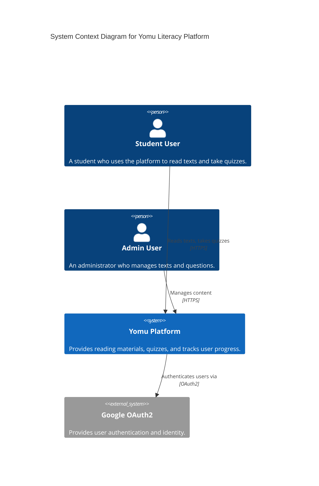
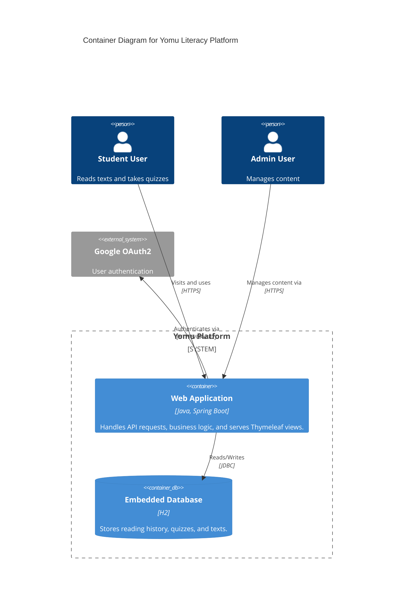
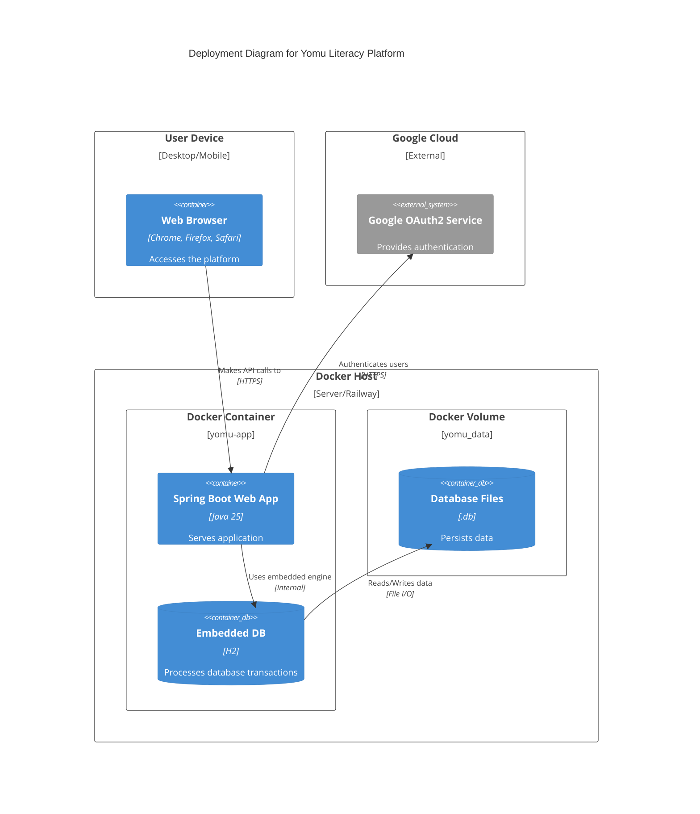
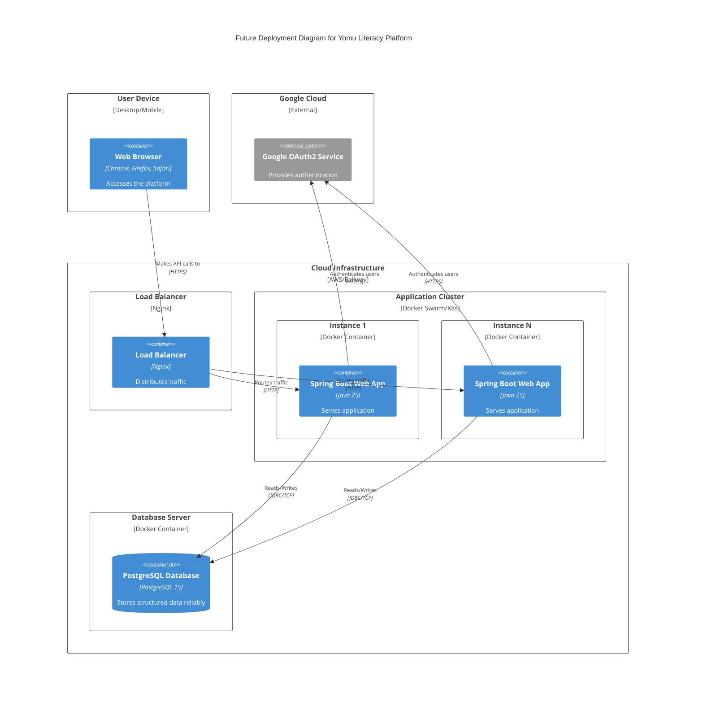

# Tutorial B: Visualizing and Architectural Risk

## 1. Current Architecture

### Context Diagram

### Container Diagram

### Deployment Diagram

## 2. Future Architecture

Based on the Risk Storming exercise, we've designed a future architecture to address scalability constraints. The monolithic approach with an embedded H2 database is replaced with load-balanced application instances and a robust standalone database.

### Future Deployment Diagram

    .